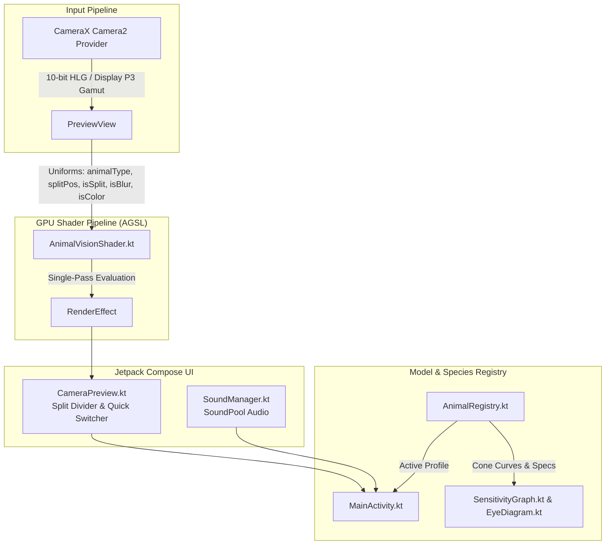

# AnimalVision (動物の視覚シミュレータ)

An Android application that transforms raw smartphone camera feeds into an anatomically and photophysically accurate real-time simulation of multi-species animal vision (**Dog**, **White-Tailed Deer**, **Cat**, **Hawk / Raptor**, **Honeybee**, and **Pit Viper**).

---

## 🔬 Biological & Photophysical Systems

```
                           HUMAN (Trichromat)                DEER (Dichromat + UV-Open)       HAWK (Avian Tetrachromat)
Photoreceptors:            S (440nm), M (535nm), L (565nm)   S (455nm), M (537nm)             UV (380nm), S (450nm), M (535nm), L (570nm)
Optics / Acuity:           20/20 (Snellen)                   20/60 (Horizontal Visual Streak) 20/5 (Bifoveal Center-Surround Optical Fovea)
Field of View:             ~180° Panoramic (~140° Binocular) ~300° Panoramic (50° Cycloverge) ~280°-300° Panoramic (~35°-50° Binocular)
Low-Light / Tapetum:       Standard Scotopic                 18x–20x Twilight Boost           Diurnal High-Contrast
```

### 1. Species Visual Profiles

* **White-Tailed Deer (*Odocoileus virginianus*)**:
  * **Cones**: S-cone ($455\text{ nm}$ UV-open) & M-cone ($537\text{ nm}$).
  * **No UV Filter**: Lacking UV-absorbing pigments in ocular media, near-UV ($380\text{--}420\text{ nm}$) and blue wavelengths stimulate S-cones with high efficiency, causing blue jeans and laundry UV brighteners to glow intensely.
  * **Blaze Orange Camouflage**: With no L-cones and a sharp cutoff above $537\text{ nm}$, hunter blaze orange transforms into a dull, low-contrast brownish-gray.
  * **Acuity & Tapetum**: $20/60$ acuity with horizontal visual streak and $18\text{--}20\times$ crepuscular tapetum amplification.

* **Hawk / Raptor (*Avian Bifoveal Tetrachromat*)**:
  * **Bifoveal Center-Surround Vision**: Panoramic $280^\circ\text{--}300^\circ$ peripheral field combined with a central deep fovea (*fovea centralis profunda*) that provides $\sim 2.0\times$ optical negative-lens magnification and ultra-sharp $20/5$ dual-foveal edge enhancement.
  * **Tetrachromacy & Oil Droplets**: 4 cone types with carotenoid oil droplets for sharp wavelength filtering, revealing ultraviolet plumage markings in false-color violet luminescence.

* **Honeybee (*Apis mellifera*)**:
  * **UV-Blue-Green Vision**: Photoreceptors at $345\text{ nm}$ (UV), $440\text{ nm}$ (Blue), and $540\text{ nm}$ (Green). Completely blind to long red wavelengths ($>580\text{ nm} \to$ black).
  * **Compound Eye Mosaic**: Hexagonal ommatidia facet grid sampling exposing floral UV nectar guides in "bee-purple".

* **Domestic Cat (*Felis catus*)**:
  * **Rod Dominance**: $25:1$ rod-to-cone ratio, vertical stenopaeic slit pupil, pastel daylight colors, and $6\text{--}8\times$ cyan-green night tapetum amplification.

* **Domestic Dog (*Canis lupus familiaris*)**:
  * **Deuteranopia**: S-cone ($435\text{ nm}$) and M/L-cone ($555\text{ nm}$), blue-yellow dimeric color space, $20/75$ isotropic blur, and $4\text{--}5\times$ tapetum boost.

* **Pit Viper (*Crotalinae*)**:
  * **Optic Tectum Fusion**: Dichromatic visual backdrop fused with false-color FLIR thermal infrared heat-map radiance ($8\text{--}12\ \mu\text{m}$).

---

## 🚀 Key Features

* **Real-Time AGSL GPU Pipeline**: 60+ FPS single-pass shader execution directly on camera framebuffers using Android 13+ Android Graphics Shading Language (`RuntimeShader` and `RenderEffect`).
* **Live Species Switching**: Instant switching between all 6 animal profiles on the info screen or via the floating quick-switch bar in the live camera preview.
* **Interactive Live Split-Screen Comparison**: Drag a real-time wipe divider across the live camera feed to compare human trichromatic vision against any animal perspective.
* **10-bit HLG HDR & Wide Color Gamut**: Requests 10-bit HLG dynamic range from CameraX and Display P3 wide gamut on supported displays.
* **Zero-Latency Sound Engine**: Preloaded `SoundPool` audio architecture with species-specific pitch modulation.
* **Interactive Educational HUD**: Dynamic Compose `Canvas` visualizations plotting multi-cone sensitivity curves ($320\text{--}720\text{ nm}$) and ocular anatomy drawings.
* **Bilingual Support**: Instant runtime locale switching between English and Japanese via AndroidX `AppLocales`.

---

## 📐 Architecture & Tech Stack



* **Target SDK**: Android 15 (API 35) / Minimum SDK: Android 13 (API 33).
* **UI**: 100% Jetpack Compose with Material 3.
* **Camera**: AndroidX CameraX (`camera-camera2`, `camera-lifecycle`, `camera-view`).
* **Graphics**: AGSL (`android.graphics.RuntimeShader`, `android.graphics.RenderEffect`).
* **Audio**: `android.media.SoundPool` with `AudioAttributes.USAGE_GAME`.

---

## 🛠️ Build & Test

### Run Unit Tests
```bash
./gradlew test
```

### Assemble Debug APK
```bash
./gradlew assembleDebug
```

---

## 📚 References & Scientific Literature

1. **National Deer Association (NDA)** & **UGA Deer Lab (2022)**. *Facts About Deer Vision & Spectral Photoreception*.
2. **Neitz, J., Geist, T., & Jacobs, G. H. (1989)**. *Color vision in the dog*. Visual Neuroscience, 3(2), 119-125.
3. **Tucker, V. A. (2000)**. *The deep fovea, bifoveal vision and acuity in raptors*. Journal of Experimental Biology, 203(24), 3745-3754.
4. **Peitsch, D., et al. (1992)**. *The spectral input systems of hymenopteran visual systems (Apis mellifera)*. Journal of Comparative Physiology A, 170(1), 23-40.
5. **Brettel, H., Viénot, F., & Mollon, J. D. (1997)**. *Computerized simulation of color appearance for dichromats*. JOSA A, 14(10), 2647-2655.
6. **Smith, V. C., & Pokorny, J. (1975)**. *Spectral sensitivity of the foveal cone photopigments between 400 and 500 nm*. Vision Research, 15(2), 161-171.
